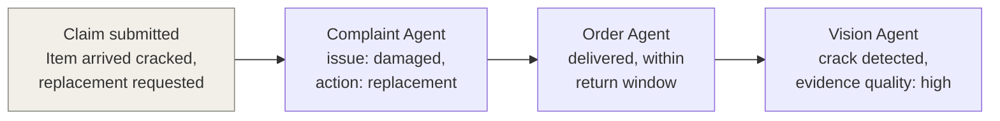
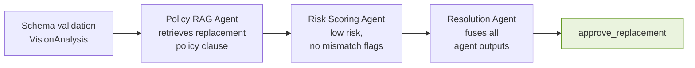

# Resolve-Claim AI

Resolve-Claim AI is an agentic, multimodal solution designed to streamline and automate e-commerce refund and replacement claims. By leveraging specialized AI agents through LangGraph, it enhances efficiency, accuracy, and policy compliance in claims management.

## Features

* **Automated Claim Processing**: Utilizes AI capabilities for complaint analysis, image-based damage assessment, policy retrieval, and risk/mismatch detection to resolve claims efficiently.
* **Image Analysis**: Employs Vision Language Models (Groq Vision) to evaluate uploaded product/package images for damage type, severity, and evidence quality.
* **Natural Language Processing**: Analyzes customer complaint text to extract issue type, requested action, sentiment( Positive / Negative / Neutral) , and urgency relevant to the claim.
* **Policy-RAG Retrieval**: Retrieves retailer-specific policy clauses via Pinecone + SentenceTransformer embeddings to ground every decision in actual policy text rather than guesswork.
* **Risk & Mismatch Detection**: Flags inconsistencies between complaint, order, and evidence signals, and scores overall claim risk to safeguard against potentially fraudulent or unsupported claims.
* **Schema-Validated Outputs**: Every agent's output is validated against a Pydantic schema before moving forward, preventing malformed or hallucinated outputs from propagating.
* **Manual Review Fallback**: Routes unclear, unsupported, missing-evidence, or high-risk claims to manual review instead of blindly approving them.
* **Gradio Dashboard**: Provides a local interface for submitting complaints, product images, retailer selection, and order metadata.

## Agent Architecture

* **LangGraph Supervisor**: Controls claim routing and decides which step runs next.
* **Complaint Agent**: Extracts issue type, requested action, sentiment, urgency, and summary from customer text.
* **Order Agent**: Evaluates order status, delivery status, return window, order value, and claim history.
* **Vision Agent**: Analyzes product/package images for visible damage evidence.
* **Policy RAG Agent**: Retrieves relevant retailer-specific policy clauses from Pinecone.
* **Risk Scoring Agent**: Computes claim risk and identifies mismatch/risk flags.
* **Resolution Agent**: Generates the final claim decision using complaint, order, vision, policy, and risk signals.

## Claim Flow

**Step 1 — Intake & evidence**


**Step 2 — Policy, risk & decision**


## Supported Models

Resolve-Claim AI uses `llama-3.1-8b-instant` through Groq for complaint understanding and `meta-llama/llama-4-scout-17b-16e-instruct` through Groq Vision for product/package image analysis.

The Complaint Agent extracts issue type, requested action, sentiment (positive / negative /neutral) , urgency, and summary from customer text. The Vision Agent detects visible damage, damage type, severity, evidence quality, and confidence from uploaded images.                                                

For Policy-RAG retrieval, the system uses `sentence-transformers/all-MiniLM-L6-v2` embeddings with Pinecone as the vector database. An optional local MLX vision backend using `mlx-community/Qwen2.5-VL-3B-Instruct-4bit` is included as an extension, but Groq Vision is the primary working backend.
(Open source models will be supported soon.)
The workflow is orchestrated using LangGraph and structured outputs are validated using Pydantic.

## Installation Guide

1. Clone the Repository:
  Open your terminal or command prompt and execute:
   ```
    git clone https://github.com/siddhiwanzkhade/Resolve-Claim-AI.git
   ```
2. Navigate to Project Directory
    ```
    cd Resolve-Claim-AI
    ```
3. Set Up a Virtual Environment (Optional but Recommended):
    Create and activate a virtual environment:
    ```
    python -m venv resolve_claim_env
    source resolve_claim_env/bin/activate
    ```
    
4. Install Dependencies:
  Ensure you have the following prerequisites installed on your system:
   ```
     pip install -r requirements.txt
   ```
5. Set Up Environment Variables:
   Create a `.env` file in the project root directory to store environment-specific variables, such as API keys.

6. Build the Policy Vector Index:
   Run this once before first use to ingest and embed the retailer policy PDFs into Pinecone:
   ```
   python src/ingestion/build_policy_index.py
   ```

## Usage 
After installation, you can use Claims-Resolve AI's Gradio dashboard to experiment with sample claim cases. To launch the dashboard, run:
```
python app.py
```
* **Submit Claims**: Use the application's interface to submit e-commerce claims with the necessary order details, retailer selection, and product/package images.
* **Automated Processing**: Leverage AI capabilities for complaint analysis, vision-based damage assessment, policy retrieval, and risk/mismatch detection to resolve claims efficiently.

   
   

